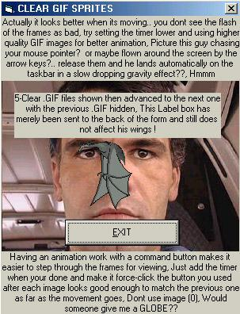



## CLEAR GIF ANIMATIONS with a TIMER on any form

### Description

Just a trick to share I hit by accident one day on making backgrounds visible with the use of CLEAR BACKGROUND GIF files, I use MS-Gif-Animator to make the outer edges of each birds "frame" transparent instead of the black/white of each overwriting each other that other sprite coders are doing for animations, each is just a gif with a clear background get it?, thus 1 image vs. 2 of each image, each image is either visible or not via the timer and the "a=a+1 variable" (it just activates the NEXT FRAME button and (also a great option for checking what the image looks like in movement if you disable the timer and make it visible again), Someone give me a dang globe?, hahahaha, Enjoy
 
### More Info
 

             |
---                |---
**Submitted On**   |2001-11-16 18:13:18
**By**             |[Rob in New Hampshire](https://github.com/Planet-Source-Code/PSCIndex/blob/master/ByAuthor/rob-in-new-hampshire.md)
**Level**          |Intermediate
**User Rating**    |4.7 (42 globes from 9 users)
**Compatibility**  |VB 6\.0
**Category**       |[Graphics](https://github.com/Planet-Source-Code/PSCIndex/blob/master/ByCategory/graphics__1-46.md)
**World**          |[Visual Basic](https://github.com/Planet-Source-Code/PSCIndex/blob/master/ByWorld/visual-basic.md)
**Archive File**   |[CLEAR\_GIF\_3564811162001\.zip](https://github.com/Planet-Source-Code/rob-in-new-hampshire-clear-gif-animations-with-a-timer-on-any-form__1-28953/archive/master.zip)

